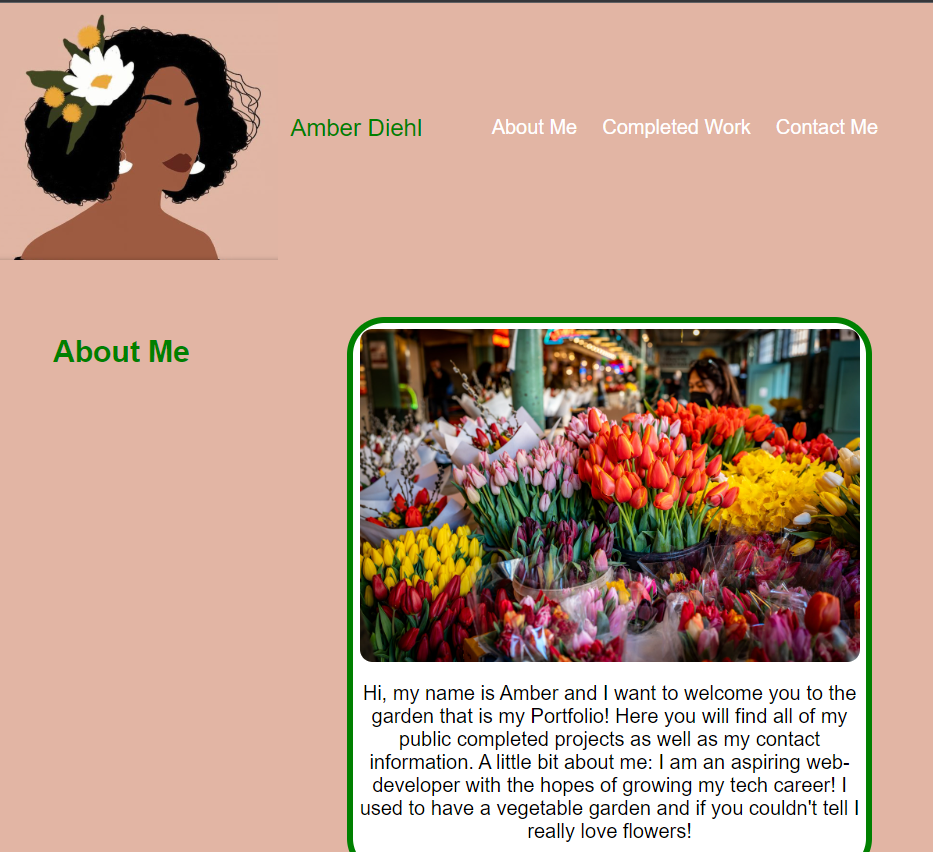

# Ambers-Portfolio
Professional Portfolio in the Genesis stage.
## Description
Use the following questions as a guide:
- What was your motivation?
    - I needed a professional portfolio for future tech interviews and organization of future projects.
- Why did you build this project? (Note: the answer is not "Because it 
was a homework assignment.")
    - To keep a live time location for all of my projects and practice code for companies and potential colleagues.
- What problem does it solve?
    - It solves the problem of having a place to improve old code and practice new code for myself.
- What did you learn?
    - I need to practice more CSS styling and creating a website from scratch is harder than I thought it would be.

## Installation
What are the steps required to install your project? Provide a step-by-step description of how to get the development environment running.
- Create a github repo with a unique name 
- clone the https github repo URL into git using the git clone function
- type in "code ." into git once the repo is saved on your computer
- VSCode will pop up onto your desktop and within VSCode you have the ability to edit and save committed material within VSCode. 
- this is communicating with Git when you are complete with changes utilize "git add ." to sync all changes
- use "git commit -m "enter commit messages" to commit the changes into git
- use "git push origin main" as the final push into github where you will see all of your saved changes and a copy of the code. 

## Usage
Provide instructions and examples for use. Include screenshots as needed.
https://amberdiehl1.github.io/Ambers-Portfolio/   github link
https://github.com/AmberDiehl1/Ambers-Portfolio   portfolio link

To add a screenshot, create an `assets/images` folder in your repository and upload your screenshot to it. Then, using the relative filepath, add it to your README using the following syntax:

## Credits
List your collaborators, if any, with links to their GitHub profiles.
TA's for the FullStack Flex Course they have been great! Especially Tye!!!